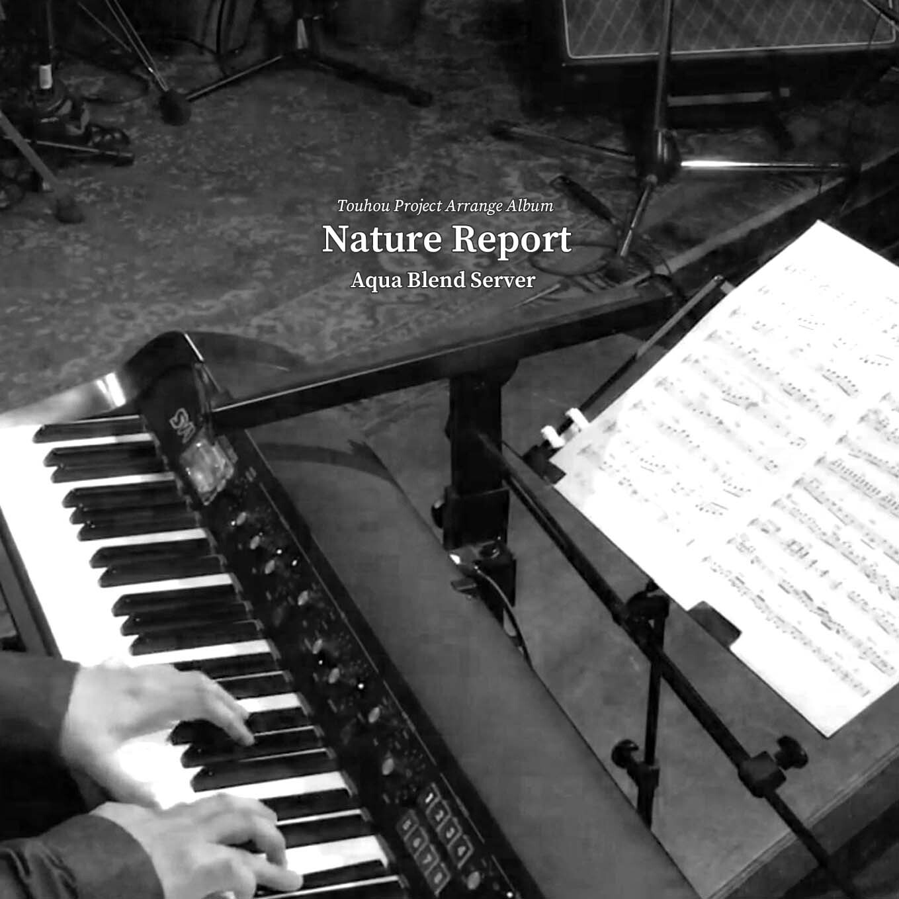

2022年5月8日に開催された博麗神社例大祭19にて頒布された新譜『Nature Report』を少数にはなりますが、メロンブックス様に委託していただきました。  
イベントに参加できなかった、買い逃した方は下記URLの通販ページからお求め下さい。  
現在予約受付中で、順次販売開始の予定になります。  
  
https://www.melonbooks.co.jp/detail/detail.php?product_id=1469988  
  

## 新譜詳細

### Nature Report

- 頒布日
    - 2022-05-08（博麗神社例大祭19）
- 頒布価格
    - 500円
  
1. Fall Of The Light（信仰は儚き人間の為に）
2. Third Time's The Charm（少女さとり ～ 3rd eye）
3. Cheer Together（死体旅行 ～ Be of good cheer!）
4. 1884（明治十七年の上海アリス）
5. Being Apple（Bad Apple!!）
6. 8:09 p.m.（厄神様の通り道　～ Dark Road & 運命のダークサイド）

